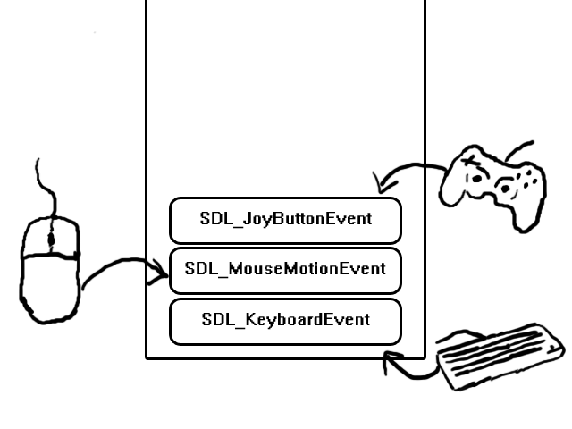
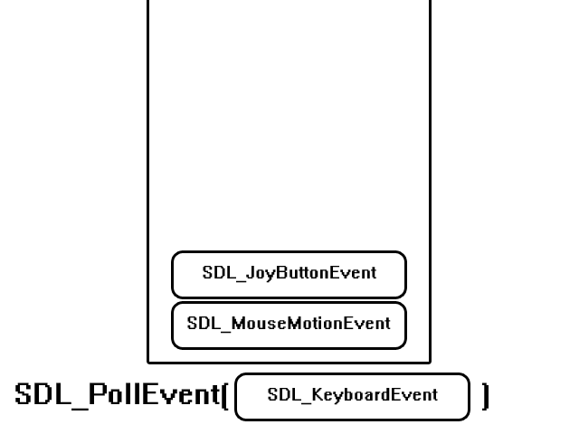

事件驱动的编程

最后更新日期：2024年5月25日

一个游戏不能只在屏幕上显示一张图片，还需要处理玩家的输入。你可以在SDL中使用事件处理系统来完成这个工作

            // 主循环标志
            bool quit = false;

            //Event handler
            SDL_Event e;

在我们的代码中，在SDL初始化和加载媒体之后，我们声明了一个退出标志，一直在检查用户是否决定退出。刚开始的时候，这个标志显然要初始化为false。

我们还声明了一个SDL_Event变量，SDL中，事件包含了，比如某个键被按下，鼠标移动，手柄按键按下等。这里我们监听退出事件，然后退出程序

            // 应用退出前一直循环
            while( !quit )
            {

在上一篇教程中，我们在关闭程序之前等了几秒钟，这里，我们一直等到玩家关闭程序，这也是任何游戏的核心。

                // 处理退出事件
                while( SDL_PollEvent( &e ) != 0 )
                {
                    // 用户要求退出
                    if( e.type == SDL_QUIT )
                    {
                        quit = true;
                    }
                }

在主循环的开始，我们有一个事件循环，它的功能是持续处理事件队列直到队列为空。

当你按了一个按键，移动鼠标，或者触摸屏幕的时候，就会有一个事件被加入到队列里。

事件队列会按照事件产生的顺序存储这些事件，等着你去处理。如果你想检查有什么事件需要你处理的时候，就用SDL_PollEvent来得到最顶层的事件，SDL_PollEvent做的事情就是把最近产生的事件出队，然后放到你传入的SDL_Event结构内。

SDL_PollEvent会持续把事件从队列中取出，知道队列为空。队列为空之后，SDL_PollEvent会返回0。所以这段代码做的事情就是，一直从事件队列中取出事件，知道队列为空。如果从队列中取到了一个SDL_QUIT事件（用户在界面上点击X关闭窗口的时候产生），我们就设置退出标志为true，然后退出应用

                // 显示图像
                SDL_BlitSurface( gXOut, NULL, gScreenSurface, NULL );
            
                //Update the surface
                SDL_UpdateWindowSurface( gWindow );
            }

当处理完一帧内的事件，我们就画一次图像并更新一次（如上一教程讨论的）。然后再进入外层循环，如果退出标记被设置为true，应用会退出外层循环后结束。如果退出标志还是false，就继续循环，知道用户按下了窗口上的X。
